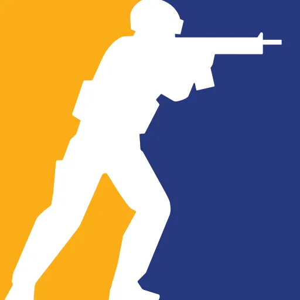

<div align="center">

# 🦅 LooterStrike

<p align="center">
  
  <span style="font-family: 'Orbitron', sans-serif; font-weight: 700; font-size: 3rem; color: #F1FAEE; text-shadow: 0 0 20px #E63946, 0 0 40px #E63946;">
    LooterStrike
  </span>
  
</p>

**Strike Fast. Loot Hard.**

Plateforme e-sport pour tournois et competitions de jeux shooter, looter et extracteur

[](https://laravel.com)
[](https://php.net)
[](LICENSE)

</div>

---

## 🎨 Design System

### Palette de Couleurs

| Couleur | Hex | Usage |
|---------|-----|-------|
| Primary | `#1A1A1D` | Fond principal, en-têtes |
| Secondary | `#E63946` | Accents, boutons CTA |
| Accent 1 | `#F77F00` | Highlights, hover states |
| Accent 2 | `#457B9D` | Liens, informations |
| Info | `#00B4D8` | Messages d'information |
| Success | `#2A9D8F` | Succès, confirmations |
| Warning | `#F4A261` | Avertissements |
| Text | `#F1FAEE` | Texte principal |
| Background Panels | `#2B2B2E` | Panneaux, cartes |
| Border | `#555555` | Bordures, séparateurs |

### Typographie

- **Font Principale**: Instrument Sans (Google Fonts) - Corps de texte
- **Font Secondaire**: Orbitron (Google Fonts) - Logo uniquement

---

## 📋 Table des Matieres

- [Aperçu](#-aperçu)
- [Fonctionnalités](#-fonctionnalités)
- [Stack Technique](#-stack-technique)
- [Configuration Requise](#-configuration-requise)
- [Installation](#-installation)
- [Configuration](#-configuration)
- [Base de Donnees](#-base-de-donnees)
- [Lancer l'Application](#-lancer-lapplication)
- [Authentification Steam](#-authentification-steam)
- [Structure du Projet](#-structure-du-projet)
- [Commandes Utiles](#-commandes-utiles)
- [Contribution](#-contribution)
- [Licence](#-licence)

---

## 🔍 Aperçu

**LooterStrike** est une plateforme e-sport pour jeux shooter, looter et extracteur. Elle prend en charge:

- 🎯 **Counter-Strike 2** — CS2 competitif
- 🦅 **Tom Clancy's The Division 1 & 2** — PvE/PvP loot
- 🛡️ **Tom Clancy's Ghost Recon** — Tactical shooter
- 💀 **Escape from Tarkov** — Hardcore extraction
- 🏟️ **Arena Breakout** — Extraction shooter
- 🔫 **Call of Duty** — Battle Royal & Warzone
- 🦅 **Fortnite** — Battle Royal
- 🎯 **PUBG** — Battle Royal
- 🎮 **Autres** — Jeux shooter, looter, extraction a venir

La plateforme permet aux joueurs de:

---

## ✨ Fonctionnalites

- 🎮 **Authentification Steam** — Connexion via OpenID Steam
- 🏆 **Gestion des Tournois** — Creation et inscription aux tournois
- 📊 **Statistiques Joueurs** — Stats multijeurs et historial de matchs
- 📺 **Live Streaming** — Suivi des matchs en direct
- 🛒 **Boutique** — Achat d'articles et equipements
- 📰 **Actualites** — News e-sport et mises a jour
- 👤 **Profil Joueur** — Avatar Steam, historique, achievements
- 🎯 **Matchmaking** — Systeme de match competif

---

## 🧰 Stack Technique

### Framework Principal

| Package | Version | Purpose |
|---------|---------|---------|
| [Laravel](https://laravel.com) | `^12.0` | PHP framework |
| [PHP](https://php.net) | `^8.2` | Runtime |
| [Laravel Breeze](https://laravel.com/docs/breeze) | `^3.0` | Auth scaffolding |
| [Laravel Sanctum](https://laravel.com/docs/sanctum) | `^4.0` | API token auth |

### Frontend

| Package | Version | Purpose |
|---------|---------|---------|
| Bootstrap | `5.x` | CSS framework |
| Vite | `^6.0` | Build tool |
| Tailwind CSS | `^3.4` | Utility CSS |

### Services

| Service | Purpose |
|---------|---------|
| [Steam OpenID](https://steamcommunity.com/dev) | Authentification Steam |
| [Steam Web API](https://developer.valvesoftware.com/wiki/Steam_Web_API) | Stats joueur CS2 |

---

## ⚙️ Configuration Requise

| Requirement | Minimum Version |
|-------------|-----------------|
| PHP | `8.2+` |
| Composer | `2.x` |
| Node.js | `18+` |
| npm | `9+` |
| MySQL / MariaDB | `8.0+` / `10.4+` |

### Installer les Dependances Systeme (Ubuntu/Debian)

```bash
sudo apt-get update
sudo apt-get install -y php8.2 php8.2-cli php8.2-fpm php8.2-mysql \
    php8.2-xml php8.2-mbstring php8.2-curl php8.2-zip php8.2-bcmath \
    php8.2-gd php8.2-intl
```

---

## 🚀 Installation

### 1. Cloner le Depot

```bash
git clone https://github.com/votre-repo/looterStrike.git
cd looterStrike
```

### 2. Installer les Dependances PHP

```bash
composer install
```

### 3. Installer les Dependances Node

```bash
npm install
```

### 4. Copier le Fichier Environment

```bash
cp .env.example .env
```

### 5. Generer la Cle Application

```bash
php artisan key:generate
```

---

## ⚙️ Configuration

Editez votre fichier `.env` avec vos settings locaux:

```dotenv
APP_NAME="LooterStrike"
APP_ENV=local
APP_DEBUG=true
APP_URL=http://localhost

# Database
DB_CONNECTION=mysql
DB_HOST=127.0.0.1
DB_PORT=3306
DB_DATABASE=looterstrike
DB_USERNAME=root
DB_PASSWORD=

# Steam OpenID
STEAM_OPENID_URL=https://steamcommunity.com/openid/login
STEAM_API_KEY=votre_steam_api_key

# Session
SESSION_DRIVER=database
```

---

## 🗄️ Base de Donnees

### 1. Creer la Base de Donnees

```sql
CREATE DATABASE looterstrike CHARACTER SET utf8mb4 COLLATE utf8mb4_unicode_ci;
```

### 2. Executer les Migrations

```bash
php artisan migrate
```

### 3. (Optionnel) Peupler la Base

```bash
php artisan db:seed
```

---

## 🏃 Lancer l'Application

### Developpement

```bash
npm run dev      # Compiler les assets (watch mode)
php artisan serve    # Demarrer le serveur local
```

Visitez: [http://localhost:8000](http://localhost:8000)

### Production

```bash
npm run production
php artisan config:cache
php artisan route:cache
php artisan view:cache
php artisan optimize
```

### Lien Storage (requis pour les uploads)

```bash
php artisan storage:link
```

---

## 🔐 Authentification Steam

### Configuration Steam OpenID

1. Obtenez une cle API Steam sur [Steam Developer Portal](https://steamcommunity.com/dev/apikey)
2. Ajoutez la cle dans votre fichier `.env`:
   ```
   STEAM_API_KEY=votre_api_key
   ```

### Flux d'Authentification

1. L'utilisateur clique sur "Login avec Steam"
2. Redirection vers Steam OpenID
3. Validation de l'identifiant Steam unique (SteamID64)
4. Creation/MAJ du compte utilisateur en base
5. Avatar Steam recupere et stocke

### Donnees Steam Recuperees

| Champ | Description |
|-------|-------------|
| steam_id | SteamID64 unique |
| name | Pseudo Steam |
| avatar | URL avatar Steam |
| profile_url | Lien profil Steam |
| country | Pays (si public) |

---

## 📁 Structure du Projet

```
looterStrike/
├── app/
│   ├── Http/
│   │   └── Controllers/
│   │       └── Auth/
│   │           └── SteamController.php    # Auth Steam OpenID
│   ├── Models/
│   │   └── User.php                        # Model user + Steam fields
│   └── Services/
│       └── SteamOpenID.php                 # Service OpenID
├── database/
│   ├── migrations/
│   │   └── 2026_03_06_071615_add_steam_fields_to_users_table.php
│   └── seeders/
├── public/
│   ├── img/
│   │   └── counter-strike-2.webp          # Logo CS2
│   ├── css/
│   │   └── home.css                        # Styles custom
│   └── js/
│       └── home.js                         # Scripts
├── resources/
│   └── views/
│       ├── snippets/
│       │   ├── navbar.blade.php           # Navigation
│       │   ├── header.blade.php            # Header
│       │   └── footer.blade.php           # Footer
│       ├── auth/
│       │   ├── login.blade.php             # Page login
│       │   └── register.blade.php         # Page register
│       ├── home.blade.php                  # Page d'accueil
│       └── layouts/
│           ├── app.blade.php               # Layout principal
│           ├── guest.blade.php             # Layout guest
│           └── navigation.blade.php       # Navigation Blade
├── routes/
│   ├── web.php                             # Routes web
│   └── auth.php                            # Routes auth
├── .env.example
├── composer.json
└── vite.config.js
```

---

## 🛠️ Commandes Utiles

```bash
# Development
php artisan serve                    # Serveur dev
npm run dev                          # Compiler assets (watch)
npm run production                   # Compiler pour production

# Database
php artisan migrate                  # Executer migrations
php artisan migrate:fresh --seed    # Recréer + seed
php artisan db:seed                  # Executer seeders

# Cache
php artisan optimize:clear           # Vider tous les caches
php artisan config:cache            # Cacher config
php artisan route:cache             # Cacher routes
php artisan view:cache              # Cacher views

# Storage
php artisan storage:link             # Creer lien storage

# Tinker
php artisan tinker                   # REPL interactif
```

---

## 🤝 Contribution

Les contributions sont les bienvenues! Veuillez lire nos guidelines avant de soumettre une PR.

1. Fork le projet
2. Creer une branche (`git checkout -b feature/AmazingFeature`)
3. Commit vos changements (`git commit -m 'Add some AmazingFeature'`)
4. Push la branche (`git push origin feature/AmazingFeature`)
5. Ouvrir une Pull Request

---

## 📜 Licence

Ce projet est sous licence MIT.

---

<div align="center">

**Strike Fast. Loot Hard.** 🦅

Fait avec ❤️ par la communaute LooterStrike

</div>
